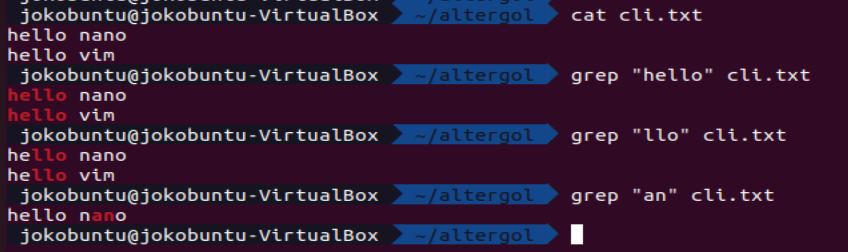
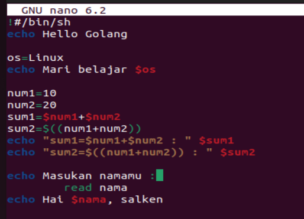
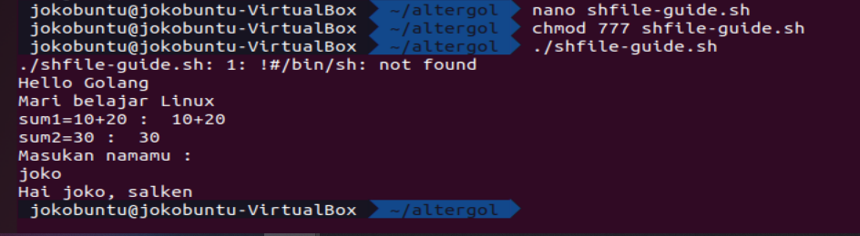

# Section 17 - Configuration Management and CLI

## Perintah CLI Linux

### About directory and files:
- ls -a = menampilkan semua filetermasuk file yang terhidden
- pwd = posisi
- cat > index.txt = membuat file index.txt dan mngedit di cmd
- touch cli.txt = membuat file kosong bernama cli.txt
  > lalu masukan kalimat, CTRL+D untuk save dan exit
- ls -l = melihat detail permission file/folder
- ls -R = melihat semua sub sub folder
- mkdir terminal = membuat folder bernama terminal
- cp index.txt terminal/index.txt = copy file index.txt ke direktori terminal/
- rm index.txt = mengahapus file index.txt
- rm -r terminal =  menghapus folder terminal beserta seluruh file didalamnya
- ln -s terminal/index.txt = membuat softlink, apabila file parent dihapus maka link menjadi broken
- ln terminal/index.txt = membuat hardlink, apabila file parent di hapus link masih bisa di akses
  > karena pada prinsipnya hard link ini ada menduplikat file dengan pointer (memory addressnya sama), jadi kalo melakukan perubahan isi maka akan saling sinkron
- cat cli.txt = melihat isi file
- chmod 777 cli.txt = mengubah permission menjadi RWXRWXRWX
- chmod 772 cli.txt = mengubah permission menjadi RWXRWX-W-
- chown alta:alterra cli.txt = mengubah owner menjadi alta dan ownergroup menjadi alterra
- diff index.txt cli.txt = membandingkan isi kedua file
### About network:
- ping 8.8.8.8 = berkomunikasi ke ip google, menandakan bahwa kita memiliki jaringan internet
- ssh = untuk melakukan remote terhadap server
- netstat = melihat traffict internet kita
- nmap = analisis port yg terbuka
- ifconfig = memonitor ip 
- wget -O result.json https://fakestoreapi.com/products = mengunduh isi link dan memasukan ke dalam file bernama result.json
- telnet : untuk remote server namun kurang aman karena dapat di sniffing dan didapatkan datanya tanpa ada enkripsi
### About manual:
- man ls = melihat manual book penggunaan perintah ls dsb
- echo "Hello Dunia" = menampilkan Hello Dunia
- echo "Namaku joko" > note.txt = auto create file note.txt dan menuliskan Namaku joko
- echo "Hobiku mematikan mic" > note.txt = replace line 1 menjadi Hobiku mematikan mic
- echo "Hobiku mematikan mic" >> note.txt = append line dengan Hobiku mematikan mic
- date = menampilkan date
- sudo = mengakses super user/ super domain (root)
- history = menampilkan history command cli yang pernah dilakukan
- grep = 
  
### About otomatisasi using file .sh:
- 
- 