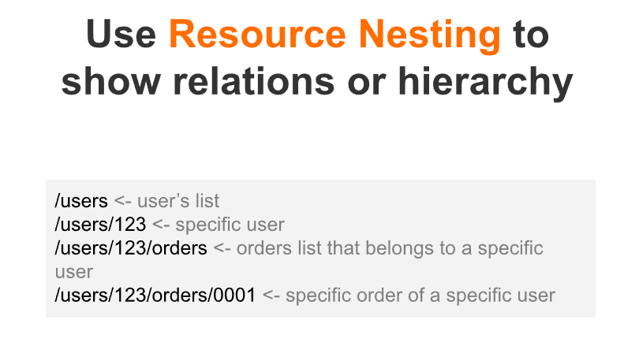
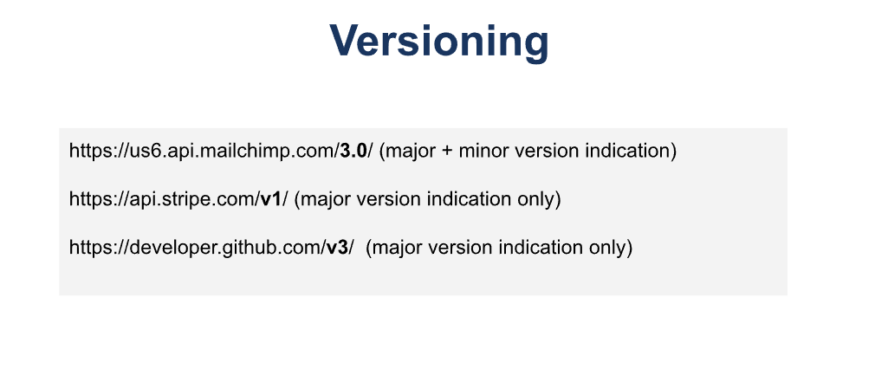
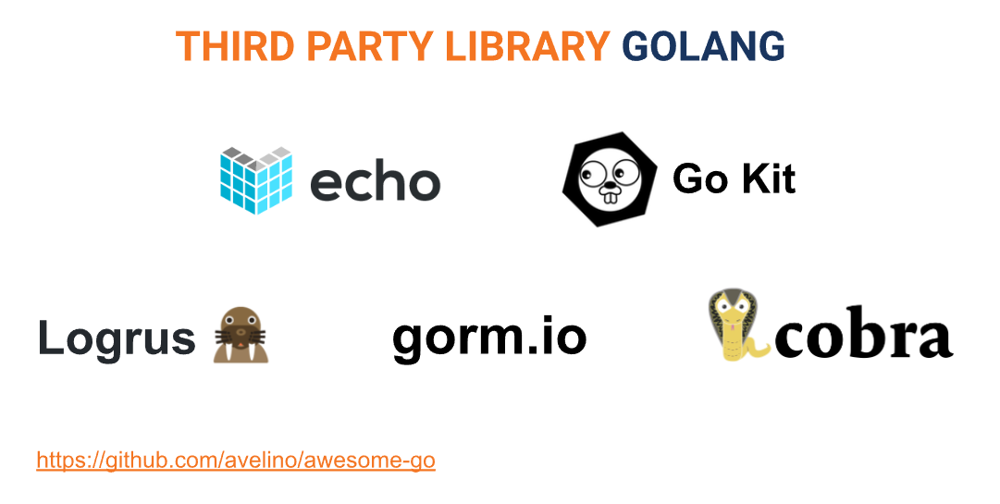

# Section 19 - Intro RESTful API

>API (Application Programming Interface) adalah kumpulan aturan dan protokol yang memungkinkan dua aplikasi perangkat lunak berbeda untuk berkomunikasi satu sama lain. API memungkinkan pengembang untuk membuat perangkat lunak yang dapat berinteraksi dengan aplikasi lain, memanfaatkan fungsi atau layanan dari aplikasi tersebut, dan memungkinkan berbagai aplikasi untuk saling berbagi data.

- API adalah cara FE dan BE berkomunikasi untuk saling memberikan request dan response

 

>RESTful atau Representational State Transfer adalah gaya arsitektur perangkat lunak untuk sistem terdistribusi seperti web. RESTful memungkinkan komunikasi antara dua sistem dengan menggunakan protokol HTTP (Hypertext Transfer Protocol) dengan berbagai metode seperti GET, POST, PUT, DELETE dan lainnya.
- berkat ESTful memungkinkan banyak FE dari platform yang berbeda dapat mengakses satu sumber API yang sama

 

REST API Best Practice:
1. Gunakan kata benda, JANGAN kata kerja. ex: books, cars, products, ~~addBook~~, ~~deleteProduct~~
2. Gunakan kata jamak. ex: books, ~~book~~, products, ~~products~~
3. Gunakan sumber daya bersarang. ex: 

    

 

## Beberapa screenshot materi penting <b>HARUS INGAT!!!</b>

 

>untuk membuat RESTapi dapat menggunakan package "net/http", namun akan lebih mudah apabila menggunakan thrid party seperti echo dan gin