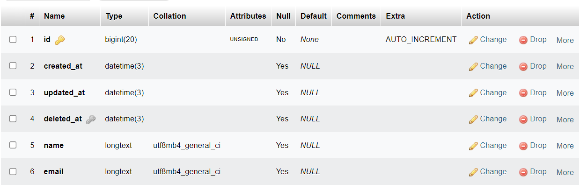

# Section 21 - ORM and Code Structure (MVC)

> ORM memudahkan dan mempercepat dalam proses developing, namun ada cost yang harus dikorbankan yaitu kecepatan/performa aplikasi.

> Performa aplikasi akan lebih cepat jika coding dilakukan tanpa ORM, karena ORM mengandung paket/fitur lengkap yang pastinya hanya kita gunakan beberapa saja


### Database migration:
- memudahkan untuk memodifikasi tabel database (mengurangi atau menambah)
- history traccker (siapa yang melakukan perubahan di database)

### Addition generated column
1. Activated
    ```go
    type User struct {
        gorm.Model
        Name  string `json:"name" form:"name"`
        Email string `json:"email" form:"email"`
    }
    ```
    

    </br>
2. Deactivated
    ```go
    type User struct {
        Name  string `json:"name" form:"name"`
        Email string `json:"email" form:"email"`
    }
    ```
    