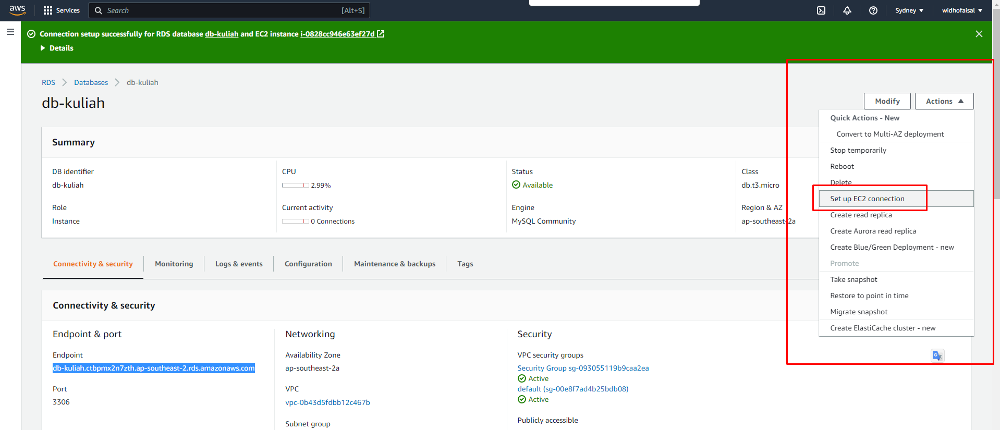
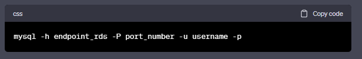

# Section 27 - Compute Service 

## Ada 4 strategi umum deployment :

1. Blue/Green Deployment Strategy: Strategi ini melibatkan pengenalan perubahan pada lingkungan produksi yang terpisah secara paralel dari lingkungan produksi yang sedang berjalan. Pengguna baru dialihkan ke lingkungan baru secara bertahap, dan pengguna lama masih dapat mengakses lingkungan lama selama pengujian dan penyelesaian perubahan pada lingkungan baru. Jika lingkungan baru berfungsi dengan baik, pengguna dapat dialihkan sepenuhnya ke lingkungan baru, dan lingkungan lama dapat dihapus.
2. Canary Deployment Strategy: Strategi ini melibatkan pengenalan perubahan pada lingkungan produksi dengan cara mengirimkan perubahan hanya pada sekelompok pengguna terpilih terlebih dahulu, sementara pengguna lain masih menggunakan aplikasi atau sistem yang lama. Pengujian dilakukan pada kelompok pengguna kecil terlebih dahulu sebelum penggunaan diperluas ke seluruh pengguna. Strategi ini memungkinkan untuk mendeteksi masalah pada perubahan dengan cepat dan membatasi dampak dari masalah tersebut.
3. Rollout Deployment Strategy: Strategi ini melibatkan pengenalan perubahan pada lingkungan produksi secara bertahap dan terencana. Pengenalan perubahan dilakukan secara bertahap pada beberapa bagian sistem atau pada sejumlah kecil pengguna terlebih dahulu sebelum memperkenalkan perubahan ke seluruh sistem atau pengguna. Dengan demikian, jika ada masalah yang terjadi selama tahap pengujian atau rollout, perubahan dapat dihentikan atau dibatalkan sebelum mengenai keseluruhan sistem.
4. Big Bang/Replace Deployment Strategy: Strategi ini melibatkan pengenalan perubahan pada seluruh sistem atau aplikasi secara langsung. Semua pengguna akan mengalami pengenalan perubahan secara bersamaan. Strategi ini dapat memberikan pengenalan perubahan yang cepat dan sederhana, tetapi juga memiliki risiko downtime atau kerusakan pada aplikasi atau sistem yang sedang berjalan lebih tinggi dibandingkan dengan strategi pengenalan perubahan yang dilakukan secara bertahap.

## Langkah langkah membuat koneksi RDS ke EC2:
1.  membuat instance dan membuat rds
2.  masuk ke menu rds, pilih action dan set up EC2 connection, pilih nama instance yang tadi dibuat
    

3.  lalu deploy aplikasi golang mu yang mengandung database biasa
4.  install jg mysql server dan client, pastikan aplikasi bisa di running sempurna menggunakan database yang ada di server
5.  selanjutnya ubah configurasi aplikasi mengikuti configurasi milik rds
    
    - username, password sesuai saat membuat rds
    - host adalah endpoint rds
    - name adalah database name, kamu perlu membuat dulu dengan cara masuk ke mysql rds
6.  cara masuk ke mysql rds:
    
    - username dan passsword adalah saat membuat rds
7. selesai dehhhhhh.......
